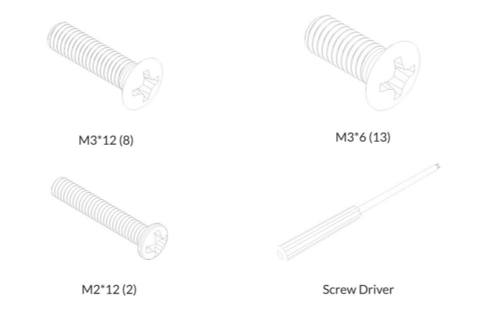
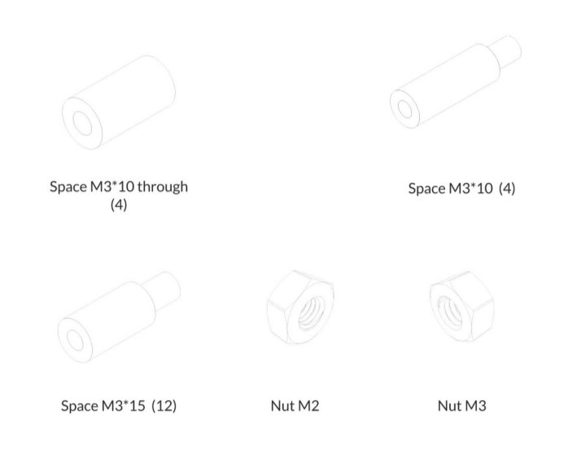
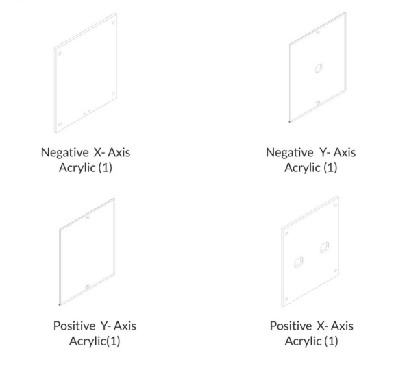
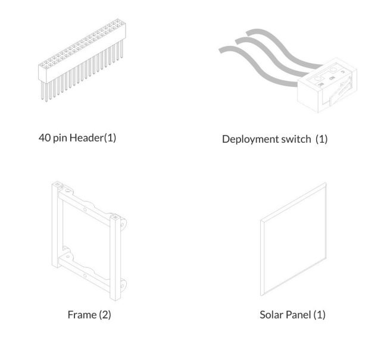

---
next:
  text: Assembly
  link: /third.md

prev:
  text: Conclusion 
  link: /conclusion.md
---

# Components

____

<head>
  <meta name="viewport" content="width=device-width, initial-scale=1">
  <link href="https://cdn.jsdelivr.net/npm/bootstrap-icons@1.7.2/font/bootstrap-icons.css" rel="stylesheet">
</head>

 
 
 

:::tip
Before assembling, please confirm that you have the right amount of each part. Also remember some parts are similar to others.
:::

 
 

 

 

 

<a href="https://antarikchya.org.np/" target="_blank">
  <Badge text="Antarikchya website" type="string" />
</a>

